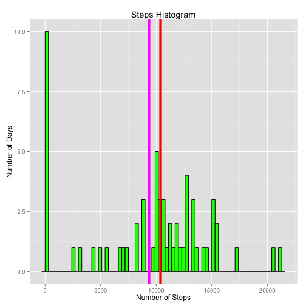
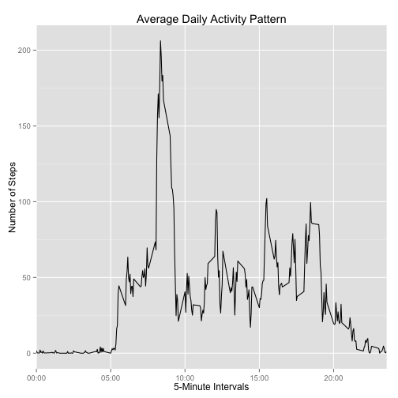
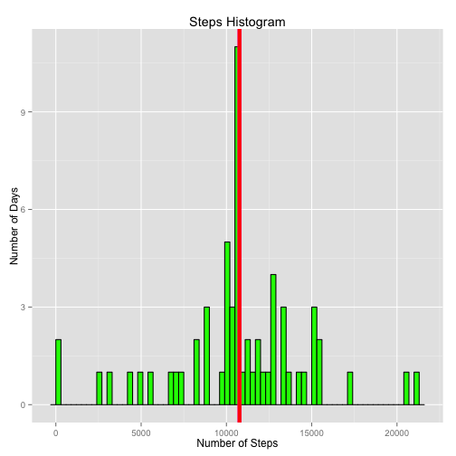
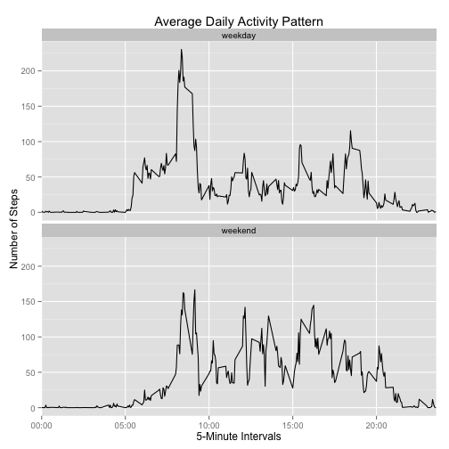

This is an R Markdown document. Markdown is a simple formatting syntax for authoring HTML, PDF, and MS Word documents. For more details on using R Markdown see <http://rmarkdown.rstudio.com>.


## Loading and preprocessing the data

Here is the code chunk to read the data.


```r
amd <- read.csv("./activity.csv", sep=",")
```

## Mean and median total number of steps per day

Here is the code chunk to aggregate the number os steps by day.


```r
days <- c(as.Date(unique(amd$date)))
nd <- length(days)
vSteps <- vector(mode = "integer", length = 0)
for (i in 1:nd) {
      vSteps <- rbind( vSteps, sum(amd$steps[as.Date(amd$date)==days[i]], na.rm=TRUE))
}
```

Now a histogram of the total number of steps taken each day is made.
The mean and median total number of steps taken by day are computed and showed in the graphic.


```r
library(ggplot2)
meanSteps = mean(vSteps, na.rm = TRUE)
medianSteps = median(vSteps, na.rm = TRUE)
ggplot() + labs(title = "Steps Histogram", x="Number of Steps", y="Number of Days") +
      geom_histogram(aes(x = vSteps), color="black", fill = "green", binwidth=300) +
      geom_vline(xintercept = meanSteps, color = "magenta", size = 2) +
      geom_vline(xintercept = medianSteps, color = "red", size = 2)
```

 

The mean total number of steps taken by day is 9354.2295, represented in the graphic by the vertical line in magenta.

The median total number of steps taken per day is 10395, represented in the graphic by the vertical line in red.

## Identifying the average daily activity pattern

Here is the code chunk to compute the average number of steps taken by 5-minute interval, averaged across all days.


```r
intervals <- c(unique(amd$interval))
ni <- length(intervals)
vStepsI <- vector(mode = "numeric", length = 0) 
for (i in 1:ni) {
      vStepsI <- rbind(vStepsI, mean(amd$steps[amd$interval==intervals[i]], na.rm=TRUE))
}
```

Now a time series plot is made to show the average daily activity pattern.


```r
ggplot() + labs(title = "Average Daily Activity Pattern", y = "Number of Steps") +
      geom_line(aes(intervals, vStepsI)) +
      scale_x_discrete(name="5-Minute Intervals",
            breaks=c(0000, 0500, 1000, 1500, 2000),
            labels=c("00:00", "05:00", "10:00", "15:00", "20:00"))
```

 

And this is the code chunk to find the 5-minute interval that contains the maximum number of steps.


```r
maxS <- max(vStepsI)
maxI <- intervals[which.max(vStepsI)]
temp <- vector( mode="character", length = 1)
temp[1] <- maxI
temp2 <- mapply(function(x, y) paste0(rep(x, y), collapse = ""), 0, 4 - nchar(temp))
temp <- paste0(temp2, temp)
tMaxI <- format(strptime(temp, format="%H%M"), format = "%H:%M")
```

The 5-minute interval that contains the maximum number of steps (206.1698) is 08:35

## Imputing missing values

Here is the code chunk to compute the number of missing values.


```r
nMissValues <- sum(is.na(amd$steps))
```

The number of rows with missing values is 2304

Now the missing values are imputed with the strategy that uses the mean of the 5-minute intervals and a new dataset is created.


```r
amd$steps[is.na(amd$steps)] <- vStepsI
write.csv(amd, file = "./completeActivity.csv", row.names = FALSE)
```

Here the number os steps by day are aggregated.


```r
newVSteps <- vector(mode = "integer", length = 0)
for (i in 1:nd) {
      newVSteps <- rbind( newVSteps, sum(amd$steps[as.Date(amd$date)==days[i]], na.rm=TRUE))
}
```

And a new histogram is made for the complete data set.


```r
library(ggplot2)
meanSteps = mean(newVSteps, na.rm = TRUE)
medianSteps = median(newVSteps, na.rm = TRUE)
ggplot() + labs(title = "Steps Histogram", x="Number of Steps", y="Number of Days") +
      geom_histogram(aes(x = newVSteps), color="black", fill = "green", binwidth=300) +
      geom_vline(xintercept = meanSteps, color = "magenta", size = 2) +
      geom_vline(xintercept = medianSteps, color = "red", size = 2)
```

 

The mean total number of steps taken by day is 1.0766 &times; 10<sup>4</sup>

The median total number of steps taken per day is 1.0766 &times; 10<sup>4</sup>

The histogram shows the impact of imputing missing data: the spike around the 0 number of steps has been removed, the median has increased a little and the mean has increased to a value equal to the median, leading to a more symetric distribution.

## Inferring if there are differences in activity patterns between weekday and weekend days

This code chunk creates a new factor variable in the data set with two levels: "weekday" and "weekend".


```r
weekDays <- weekdays(as.Date(amd$date))
vDate <- vector( mode = "integer", length = nrow(amd))
vDate <- ifelse(weekDays=="Saturday" | weekDays=="Sunday", 1, 0)
dateFactor = factor(vDate, labels=c("weekday","weekend"))
amd <- cbind(amd, dateFactor)
```

Now a panel plot containing a time series plot of the 5-minute interval and the average number of steps taken, averaged across all weekday or weekend days, is made.


```r
vStepsIDays <- data.frame(avgSteps = numeric(), dayType = factor(), interval = numeric())
for (i in 1:ni) {
      vInd <- c(amd$interval==intervals[i] & amd$dateFactor=="weekday")
      newRow <- data.frame(avgSteps = (mean(amd$steps[vInd], na.rm = TRUE)), weekDays = "weekday", interval = intervals[i] )
      vStepsIDays <- rbind(vStepsIDays, newRow)
      vInd <- c(amd$interval==intervals[i] & amd$dateFactor=="weekend")
      newRow <- data.frame(avgSteps = (mean(amd$steps[vInd], na.rm = TRUE)), weekDays = "weekend", interval = intervals[i] )
      vStepsIDays <- rbind(vStepsIDays, newRow)
}
ggplot(vStepsIDays, aes(x = interval, y = avgSteps)) +
      labs(title = "Average Daily Activity Pattern", y = "Number of Steps") +
      geom_line() + facet_wrap(~weekDays, ncol = 1) +
      scale_x_discrete(name="5-Minute Intervals",
            breaks=c(0000, 0500, 1000, 1500, 2000),
            labels=c("00:00", "05:00", "10:00", "15:00", "20:00"))
```

 
